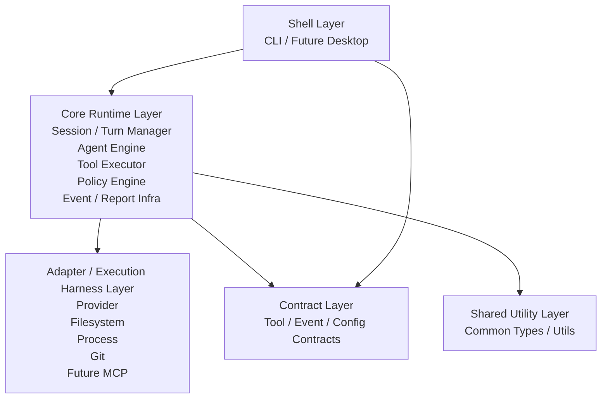

# Architecture Overview

## Purpose

This document defines the intended high-level shape of Code Orb so implementation can evolve without the core boundaries drifting.

## Architecture Views

Code Orb needs at least two architecture views:

- a logical layer view that explains responsibility and dependency direction
- a runtime view that explains how a session, turn, and step actually flow

This document focuses on the logical layer view. The runtime view is covered further in [execution-model.md](./execution-model.md).

## Layer Diagram



## Logical Layers

```text
Shell Layer
  apps/cli
  future desktop shell
  Responsibility: user interaction, input/output, approval UX, rendering

Core Runtime Layer
  packages/core
  Responsibility: session/turn execution semantics, agent loop, context engineering,
  tool orchestration, policy decisions, event/report generation

Adapter / Execution Harness Layer
  Initially colocated under packages/core as needed
  Responsibility: provider transport, filesystem, process execution, git, future MCP

Contract Layer
  packages/schemas
  Responsibility: stable tool, event, config, and report contracts

Shared Utility Layer
  packages/shared
  Responsibility: small reusable utilities and types with no product policy
```

This is a logical design, not a claim that each layer must become its own package on day one. In early versions, adapter implementations may live under `packages/core`, but they should still be treated as a separate responsibility boundary.

## Benchmark Repositories

Benchmark tasks and their associated evaluation repositories live under `benchmarks/`.

They are intentionally separate from `tests/fixtures/`:

- `tests/fixtures/` are test-support repositories used by automated tests
- `benchmarks/` are milestone and capability evaluation targets

This keeps product-evaluation tasks distinct from narrow test fixtures.

## Dependency Direction

```text
Shell
  -> Core Runtime
  -> Contract Layer

Core Runtime
  -> Contract Layer
  -> Shared Utility Layer
  -> Adapter Interfaces / Implementations

Adapter / Execution Harness
  -> External Systems
  -> Contract Layer when normalization requires shared shapes
```

Rules:

- shells own interaction, not execution semantics
- core owns execution semantics, not provider-specific transports
- adapters own real-world side effects, not task planning or loop control
- contracts must stay shell-agnostic and provider-agnostic

## Core Internal Structure

Within `packages/core`, the intended internal structure is:

```text
Session / Turn Manager
  Owns session lifecycle, turn boundaries, and step progression

Agent Engine
  Owns step-level orchestration, context engineering, model interaction,
  stop/retry decisions, and verification handoff

Tool Executor
  Owns tool dispatch, validation, execution metadata, and event emission

Policy Engine
  Owns allow / confirm / deny decisions and approval requests

Event / Report Infrastructure
  Owns structured event production and final report assembly

Adapters
  Own provider transport, filesystem, process, git, and future external integrations
```

The important separation is that the `Agent Engine` decides what should happen next, while the `Tool Executor` decides how a requested tool invocation is actually executed.

## Tool Placement

Tools cross multiple layers:

- tool contracts live in `packages/schemas`
- tool execution semantics live in `packages/core`
- concrete tool backends live in the adapter / execution harness layer

This prevents the core runtime from being locked to one filesystem, one provider, or one command execution mechanism.

## Runtime Flow

The intended runtime flow is:

1. CLI receives either a one-shot task or an interactive shell command.
2. CLI creates a session and hands execution to `packages/core`.
3. Core gathers context, plans, invokes tools, applies edits, and runs verification per turn.
4. Core emits structured events defined in `packages/schemas`.
5. CLI renders progress and turn/session reporting to the terminal.

For `0.5.0`, `apps/cli` now also owns the interactive foreground loop for `orb chat`, but the loop is only a shell concern.

- `apps/cli` owns prompt intake, slash-style control commands, and terminal interaction flow
- `packages/core` still owns session execution, turn execution, reporting, and persistence semantics

## 0.6 Runtime Contract Baseline

`0.6.0` adds a stricter interpretation of what must stay runtime-owned before later shells or a richer tool runtime can be added.

The following concerns belong to core runtime boundaries, not shell behavior:

- provider compatibility normalization
  - adapters may absorb provider-specific quirks, but the runtime should consume normalized capabilities, normalized responses, and explicit degraded or unsupported outcomes
  - for the current OpenAI-compatible adapter, the supported normalized response paths are:
    - `responses_output` as the native path
    - `responses_output_text` as a compatible responses-style path
    - `chat_completions_choices` as a compatible gateway path
    - `responses_streaming_fallback` as a degraded recovery path when non-streaming normalization returns no assistant content
  - provider error payloads or empty-content outcomes after fallback should remain terminal failures rather than being treated as assistant content
- assistant-produced edit execution
  - the runtime should distinguish generated create, generated rewrite, and targeted replacement as explicit execution behaviors instead of relying on shell-local conversational heuristics
- tool registration boundaries
  - built-in tools should remain runtime-owned registrations rather than executor-local constants or CLI-owned catalogs
- current loop semantics
  - the runtime should document what one turn-level iteration means now, even before `0.7.0` introduces a fuller multi-iteration loop

This baseline is intentionally narrower than `0.7.0`.

`0.6.0` should clarify the contract that the current runtime already depends on. It should not yet expand into a general orchestration runtime.

## Boundary Rules

- `apps/cli` should not own business logic that future shells also need.
- `packages/core` owns execution semantics and orchestration.
- adapters should isolate provider, process, filesystem, and git details from core semantics.
- `packages/schemas` owns stable cross-boundary shapes.
- `packages/shared` must stay small and generic; it is not a dumping ground.
- structured events are runtime infrastructure, not ad hoc CLI logging.
- provider compatibility handling that affects correctness must not be hidden in CLI fallback code.
- generated edit mode classification and execution must remain runtime behavior, not shell parsing behavior.
- tool registration and lookup boundaries must remain runtime-owned even when only built-in tools exist.

## Future Extension Path

Desktop support should add a new app shell that consumes the same core runtime and schemas. If desktop requires duplicating core behavior from the CLI, the boundary is wrong.

The same principle applies to future multi-provider support: provider-specific transport should be replaceable behind adapters without rewriting the core runtime.

## Related Docs

- [execution-model.md](./execution-model.md)
- [tool-system.md](./tool-system.md)
- [safety-model.md](./safety-model.md)
- [events.md](./protocols/events.md)
- [tool-contracts.md](./protocols/tool-contracts.md)
- [config-schema.md](./protocols/config-schema.md)
